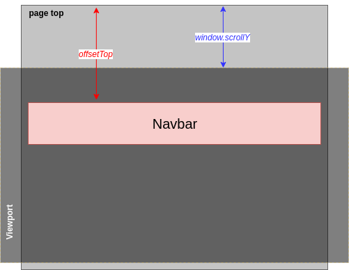

# About

This is a **sticky-navigator** made with pure JS and CSS.


[Click here](https://rodrigotamura.github.io/sticky-nav/index.html) for demo.

## How does it work?

Firstly, we need to figure out nav's top offset position:

```javascript
const nav = document.querySelector("#main"); // grabbing navbar element
const topOfNav = nav.offsetTop;
```

However, what is `offsetTop` method? 🤔

> The **HTMLElement.offsetTop** read-only property returns the distance of the current element relative to the top of the offsetParent node.
> <cite>[MDN web docs](https://developer.mozilla.org/en-US/docs/Web/API/HTMLElement/offsetTop)</cite>

**(In this case, _offsetParent_ of this navigator element is the `<body>`.)**

Maybe, you might understand better with the scheme bellow:



Our goal is, when navbar reaches the top of the viewport **by scrolling the page**, it should start to make the "magic". In order to do it, let's make our Javascript knows when this EVENT is happening. Let's add:

```javascript
window.addEventListener("scroll", fixNav);
```

Now, this `fixNav` function (which will be fired every time user scrolls the page) detects if `topNavBar` value reached the position of our vertical scroll (`window.scrollY`):

```javascript
function fixNav() {
  if (window.scrollY >= topOfNav) {
    document.body.classList.add("fixed-nav");
    document.body.style.paddingTop = nav.offsetHeight + "px";
  }
}
```

Reaching the top of viewport, we will add the following class to this navbar (`document.body.classList.add("fixed-nav");`):

```css
.fixed-nav nav {
  position: fixed;
  box-shadow: 0 5px rgba(0, 0, 0, 0.1);
}
```

The `position: fixed` property will FIX this element on the top of the viewport.

Then the command line `document.body.style.paddingTop = nav.offsetHeight + "px"` will add a padding to the top of the page. If we do not implement it our navbar will be on top of the content and the user could not read properly the firsts lines of the text. The method `offsetHeight` returns the current height of the element.

However, we need implement something when user scroll up the page, putting our navbar to the original place:

```javascript
function fixNav() {
  // if scrollY exceed topOfNav, add fixed-nav style class
  if (window.scrollY >= topOfNav) {
    document.body.style.paddingTop = nav.offsetHeight + "px";
    document.body.classList.add("fixed-nav");
  } else {
    document.body.style.paddingTop = 0;
    document.body.classList.remove("fixed-nav");
  }
}
```

The else scope is removing `fixed-nav` style class and setting the padding-top of the body back to zero.
